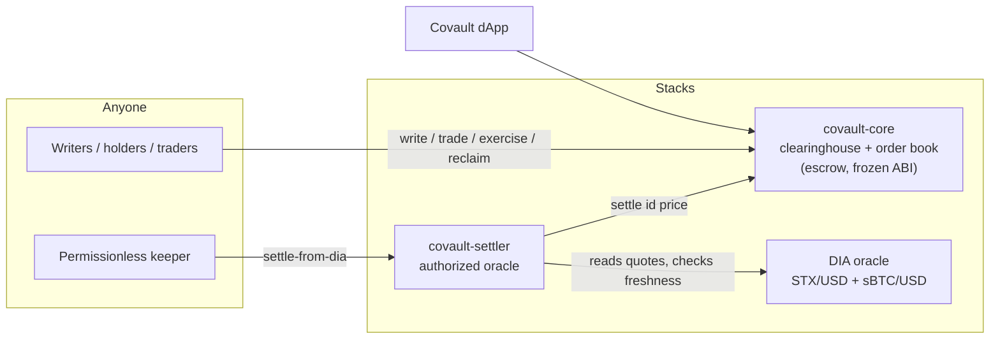

<!-- markdownlint-disable MD033 MD041 - centered masthead uses inline HTML by design -->
<div align="center">


# Covault

**Options, fully collateralized. Settled in Bitcoin.**

A fully-collateralized, cash-settled European options clearinghouse on Stacks,
collateralized and settled in **sBTC** or **native STX**.

[](https://github.com/senga-alt/covault/actions/workflows/ci.yml)

[Live testnet app](https://covault-testnet.vercel.app) ·
[Clearinghouse contract](https://explorer.hiro.so/txid/ST3XC6XFFZQZ6BRYBZRJWRF2Z790TX9GB67KBQW0R.covault-core?chain=testnet) ·
[Settler contract](https://explorer.hiro.so/txid/ST3XC6XFFZQZ6BRYBZRJWRF2Z790TX9GB67KBQW0R.covault-settler?chain=testnet) ·
[Security review](docs/SECURITY-REVIEW.md) ·
[Settlement methodology](docs/SETTLEMENT-METHODOLOGY.md)

</div>

---

Covault is a Bitcoin-native options clearinghouse written in Clarity. Anyone can
**write** (sell) options against locked collateral, **trade** the option positions
on a built-in on-chain order book, and **settle** them in cash at expiry. Each
series picks its collateral and settlement asset: **native STX** or any
**SIP-010 token (sBTC by default)**. It is designed to be the smallest options
primitive that is still safe, useful, and honest about its trust assumptions.

Built for the [Stacks Endowment Q2 2026 grants cycle](https://stacksendowment.co/blog/q2-2026-grants-are-open-fund-bitcoin-native-finance)
(RFP: *Onchain Options Trading Platform*, DeFi track).

## Why this design

Most options protocols are hard because of everything *around* the option: margin
engines, liquidation keepers, funding rates, and price oracles that have to be live
every block. Covault removes all of that by making one strict choice:

> **Every option is backed 100% by collateral that is greater than or equal to its
> maximum possible payoff.**

That single invariant has large consequences:

| Hard problem in most options protocols | How Covault avoids it |
| --- | --- |
| Writers going insolvent | Impossible - payoff is capped at the locked collateral |
| Liquidation engine + keepers | Not needed - there is nothing to liquidate |
| Margin / collateral ratios | Not needed - collateral is fixed at write time |
| Funding rates | Not applicable - these are dated options, not perps |
| Always-on oracle | Only **one** price is ever needed: the settlement price at expiry |

The result is a clearinghouse you can read top-to-bottom in one sitting, and whose
solvency is checked by machines, not just by inspection (see
[Security](#security)).

## Architecture



- **`covault-core`** holds all escrow and enforces the lifecycle. It accepts
  exactly one settlement price per series, only after expiry, only from its
  authorized `oracle` principal.
- **`covault-settler`** is that oracle: a small contract that derives the
  settlement price on-chain from DIA's USD feeds (cross-rate in collateral
  units), enforces a freshness window, and submits it. Settlement becomes
  **permissionless** - anyone can trigger it, nobody can choose the price.
  Full derivation, freshness rules, failure modes, and risk disclosures:
  [docs/SETTLEMENT-METHODOLOGY.md](docs/SETTLEMENT-METHODOLOGY.md).
- **The dApp** (in [`app/`](app/)) covers the full lifecycle: markets, series
  detail with write / trade / claim panels, portfolio with claimable values,
  and an operator console with protocol analytics.

## Collateral model

Each series is denominated in its chosen collateral asset - **native STX**
(microSTX) or a **SIP-010 token such as sBTC** (sats) - stored as
`(optional principal)` (`none` = STX, `(some P)` = the token at `P`).
`1 contract` = exposure to `1` unit of the underlying price reference, priced in
that asset's smallest units.

- **Put** - collateral per contract = `strike`. Payoff = `min(max(strike - S, 0), strike)`.
  A put can never owe more than the strike, so locking the strike fully backs it.
- **Capped call** - collateral per contract = `cap - strike` (`max-payoff`).
  Payoff = `min(max(S - strike, 0), max-payoff)`. Capping the upside is what makes a
  call fully collateralizable in cash (this is a call spread).

At settlement price `S`, for each contract holding collateral `C = max-payoff`:

```text
exercise (long holder) pays:  payoff      = min(intrinsic(S), C)
reclaim  (short writer) pays: C - payoff
                              -------------
                       total = C   (escrow is conserved exactly, no rounding)
```

## Security

The full structured review lives in
[docs/SECURITY-REVIEW.md](docs/SECURITY-REVIEW.md): threat model, invariant
test suite, adversarial tests, static checks, and a findings log with severity
and resolution status. Highlights:

- **Property-based fuzzing** ([Rendezvous](https://docs.stacks.co/rendezvous/overview)):
  the solvency and conservation invariants - payoff can never exceed locked
  collateral; payoff + leftover equals collateral exactly - are fuzzed against
  thousands of random inputs with **zero discards**, and re-proven in CI on
  every push (`npm run fuzz`).
- **41 unit tests** (Clarinet JS SDK + Vitest) cover the full lifecycle in both
  collateral assets plus the adversarial paths: authorization, timing,
  double-claim, pause behavior, fees, and the settlement trust boundary.
- **Findings log**: the review caught and resolved a High-severity issue
  (the settler originally accepted any contract shaped like DIA as a price
  source; it now only accepts the owner-pinned canonical DIA principal) and a
  Medium (missing staleness check; settlement now fails closed on stale
  quotes). No Critical or High findings are open.
- **Trust surface, stated honestly**: DIA's feed operators (price correctness
  inside the freshness window, blast radius bounded to a single series and its
  cap) and the owner key (governance only - a pause can never trap funds, and
  no owner action can move escrow).

## Contract API (`contracts/covault-core.clar`)

| Function | Who | What it does |
| --- | --- | --- |
| `create-series` | owner (v1) / anyone | Define a series: collateral asset (STX or a SIP-010 token), call/put, strike, collateral, expiry. Curated in v1; open once `set-open-creation` is on |
| `write-options` | writer | Lock collateral, mint matched long + short positions |
| `transfer-long` | holder | Send option (long) positions to another principal |
| `list-offer` / `fill-offer` / `cancel-offer` | anyone | On-chain order book for trading longs (a capped taker fee may apply on fills) |
| `close-pair` | writer | Net a long+short pair before expiry and reclaim collateral |
| `settle` | oracle | Record the settlement price for an expired series |
| `exercise` | holder | Claim the cash payoff after settlement |
| `reclaim` | writer | Reclaim leftover collateral after settlement |
| `set-oracle` / `set-owner` | owner | Reassign the oracle reporter / contract owner |
| `set-paused` | owner | Halt new writes and series creation; exits always stay open |
| `set-open-creation` | owner | Curate series creation (v1) or make it permissionless |
| `set-fee` | owner | Set the taker fee (basis points, capped at 5%) and its recipient |

Read-only: `get-series`, `get-long`, `get-short`, `get-offer`, `get-oracle`,
`get-owner`, `get-series-count`, `get-offer-count`, `quote-payoff`, and `get-config`
(a one-shot snapshot of owner, oracle, pause, fee, and counters for UIs).

The settler adds `settle-from-dia` (permissionless), `derive-price` (read-only
cross-rate), and owner-gated configuration (`set-dia-oracle`, `set-max-price-age`).
Its error codes and guards are tabulated in the
[settlement methodology](docs/SETTLEMENT-METHODOLOGY.md#6-error-codes-settler).

### Governance and safety

- **Pause** (`set-paused`) blocks only new risk (create-series, write-options). Every exit -
  settle, exercise, reclaim, close-pair, order-book trading, cancels - stays open, so a pause
  can never trap funds.
- **Curated creation** (`set-open-creation`, off by default) means v1 only lists series whose
  price reference has a vetted feed; it can be opened to everyone later.
- **Protocol fee** (`set-fee`, default 0, capped at 5%) is a taker fee charged to the buyer on
  order-book fills and sent to a configurable recipient - the sustainable-fee hook, off until
  there is usage to justify it.

### Built on canonical Stacks primitives

- **sBTC** is a real dependency, not a mock - `SM3VDXK3WZZSA84XXFKAFAF15NNZX32CTSG82JFQ4.sbtc-token`,
  added via `clarinet requirements` and remapped per-network by Clarinet.
- The token side uses the canonical **SIP-010** trait, so any SIP-010 token (sBTC by
  default) works as collateral. Value-moving functions take a `(token (optional <sip010>))`
  argument: pass `(some sBTC)` for a token series, or `none` for a native-STX series.
- **DIA oracle** - the deployed on-chain price feeds (testnet
  `ST1S5ZGRZV5K4S9205RWPRTX9RGS9JV40KQMR4G1J.dia-oracle`), consumed through a
  minimal trait that matches DIA's `get-value` interface.
- **Clarity 4** asset handling: `current-contract` for the escrow principal,
  `as-contract?` with `(with-stx amount)` allowances for native-STX payouts,
  `stacks-block-time` for oracle freshness checks, and expiry measured in
  **`burn-block-height`** (Bitcoin blocks).

## Live deployments (testnet)

| Contract | Address | Notes |
| --- | --- | --- |
| `covault-core` | [`ST3XC6XFFZQZ6BRYBZRJWRF2Z790TX9GB67KBQW0R.covault-core`](https://explorer.hiro.so/txid/ST3XC6XFFZQZ6BRYBZRJWRF2Z790TX9GB67KBQW0R.covault-core?chain=testnet) | Deployed at burn block 191855; full lifecycles completed in both STX and sBTC |
| `covault-settler` | [`ST3XC6XFFZQZ6BRYBZRJWRF2Z790TX9GB67KBQW0R.covault-settler`](https://explorer.hiro.so/txid/ST3XC6XFFZQZ6BRYBZRJWRF2Z790TX9GB67KBQW0R.covault-settler?chain=testnet) | Canonical DIA principal pinned on-chain |
| dApp | [covault-testnet.vercel.app](https://covault-testnet.vercel.app) | Full lifecycle UI + operator console |

Every completed lifecycle - deployment, writes, trades, settlement, exercise,
reclaim, with exact conservation checks - is documented transaction-by-transaction
in [docs/M1-EVIDENCE.md](docs/M1-EVIDENCE.md).

## Repository layout

```text
contracts/
  covault-core.clar        the clearinghouse + order book (deployed, frozen ABI)
  covault-settler.clar     DIA-backed permissionless settlement
  traits/                  oracle-trait, dia-trait (minimal interfaces)
  mocks/                   test doubles (simnet only, never deployed)
app/                       the dApp: Vite + React + @stacks/connect
scripts/                   lifecycle CLI - drive the deployed contract end to end
security/                  Rendezvous fuzzing harness (property tests + build script)
tests/                     41 unit tests (Clarinet JS SDK + Vitest)
deployments/               hand-authored testnet deployment plans
docs/                      product, technical, and milestone documentation
```

## Develop

Requires [Clarinet](https://docs.stacks.co/clarinet) >= 3 and Node >= 20.

```bash
npm install
clarinet check        # static analysis - 8 contracts, no errors
npm test              # 41 unit tests (Vitest + clarinet-sdk)
npm run fuzz          # property-based fuzzing (Rendezvous, 1000 runs)
clarinet console      # interactive REPL
```

All three run in CI on every push. The unit suite funds wallets with the genesis
`sbtc_balance` that Clarinet's sBTC-aware simnet seeds (see `settings/Devnet.toml`)
and exercises the full lifecycle: writing, trading, settlement, exercise/reclaim,
the order book, early netting, oracle-driven settlement, freshness and pinning
guards, and the collateral-conservation invariant.

### Run the dApp locally

```bash
cd app
npm install
npm run dev           # defaults target the live testnet deployment
```

Optional `app/.env.local` overrides (all have working defaults):
`VITE_NETWORK`, `VITE_CONTRACT_ADDRESS`, `VITE_CONTRACT_NAME`,
`VITE_SETTLER_CONTRACT` (enables the permissionless DIA settle UI),
`VITE_APP_ORIGIN` (absolute origin for social cards).

### Drive the deployed contract from the CLI

```bash
cd scripts
npm install && cp .env.example .env    # set CONTRACT_ADDRESS + MNEMONIC
npm run lifecycle -- demo              # full lifecycle in native STX
npm run lifecycle -- demo --asset=sbtc # same, collateralized in real testnet sBTC
```

The CLI covers every step individually too - `create`, `write`, `list`, `fill`,
`cancel`, `settle`, `exercise`, `reclaim`, `status`, `balance` - see
[`scripts/README.md`](scripts/README.md).

## Deploy

`covault-core` is already live on testnet (see above) and is treated as frozen.
The oracle integration deploys separately, from a hand-authored plan that
publishes **only** the traits and the settler, then pins the canonical DIA
principal:

```bash
clarinet deployments apply --testnet \
  --deployment-plan-path deployments/settler.testnet-plan.yaml
```

> Do not run a bare `clarinet deployments generate/apply --testnet` here: the
> auto-generated plan would try to republish the frozen core and deploy the
> test-only mocks. The wiring runbook (pin verification, `core.set-oracle`,
> dApp env) is in [docs/IMPLEMENTATION-PLAN.md](docs/IMPLEMENTATION-PLAN.md).

## Documentation

| Document | What it covers |
| --- | --- |
| [PRODUCT.md](PRODUCT.md) | Product strategy and positioning |
| [DESIGN.md](DESIGN.md) | The engraved-certificate visual system |
| [docs/PRD.md](docs/PRD.md) | Product requirements |
| [docs/TRD.md](docs/TRD.md) | Technical requirements and contract design |
| [docs/APP-FLOW.md](docs/APP-FLOW.md) | dApp screens and user flows |
| [docs/UX-DESIGN-BRIEF.md](docs/UX-DESIGN-BRIEF.md) | UX principles and interaction design |
| [docs/SETTLEMENT-METHODOLOGY.md](docs/SETTLEMENT-METHODOLOGY.md) | Price source, cross-rate derivation, freshness, risk disclosures |
| [docs/SECURITY-REVIEW.md](docs/SECURITY-REVIEW.md) | Threat model, fuzzing, adversarial tests, findings log |
| [docs/M1-EVIDENCE.md](docs/M1-EVIDENCE.md) | On-chain evidence for every completed testnet lifecycle |
| [docs/IMPLEMENTATION-PLAN.md](docs/IMPLEMENTATION-PLAN.md) | Build sequencing and the settler deployment runbook |
| [docs/ROADMAP.md](docs/ROADMAP.md) | What comes next |

## Status

Grant prototype, live on **Stacks testnet**. Complete today: the clearinghouse
with built-in order book, full lifecycles executed on-chain in both collateral
assets, the DIA settler (deployed, pinned, tested), the full-lifecycle dApp, the
structured security review with CI-enforced fuzzing, and this documentation set.
Next: oracle-wired settlement demo on testnet, then mainnet launch with first
real usage - see [docs/ROADMAP.md](docs/ROADMAP.md).

---

**Testnet software. Not investment advice.** Covault is an experimental
prototype under active development; do not use it with funds you cannot afford
to lose.
