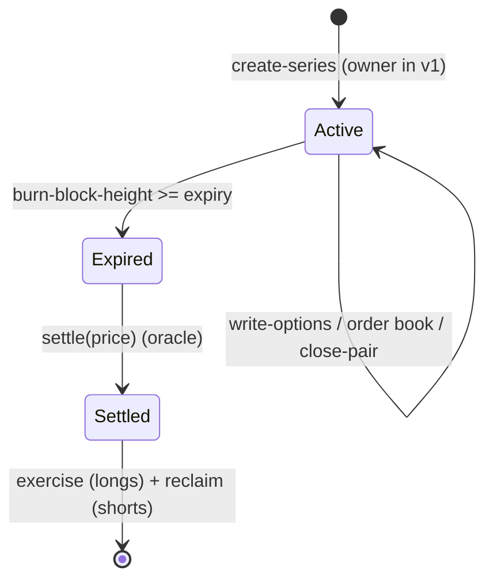
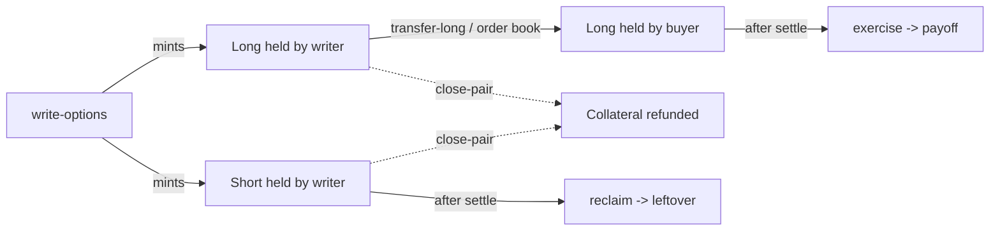
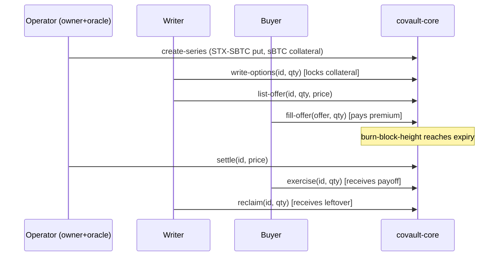

# Covault - App Flow

Status: draft v1
Related docs: [PRD](./PRD.md) - [TRD](./TRD.md) - [UX Design Brief](./UX-DESIGN-BRIEF.md)

This document describes the end-to-end flows, the series state machine, and how each user
action maps to a contract call.

## 1. Series state machine



- Active: writable and tradable. Writers lock collateral; longs trade on the order book.
- Expired: no more writing; awaiting a settlement price.
- Settled: settlement price recorded; longs exercise, shorts reclaim leftover.

## 2. Position lifecycle



## 3. Primary user journeys

### 3.1 Connect wallet
1. User opens the dApp, clicks Connect.
2. `@stacks/connect` opens Leather/Xverse; user approves.
3. dApp reads the address, network badge, and sBTC/STX balances.
Exit: session ready; no on-chain tx.

### 3.2 Browse markets
1. dApp reads `get-series-count`, then each `get-series`, plus `get-config`.
2. Renders the Markets table (type, asset, strike, expiry, status, best offer).
3. Filters by asset (sBTC/STX) and status (Active/Expired/Settled).

### 3.3 Write options (become an underwriter)
1. From a series, user enters quantity.
2. RiskSummary shows collateral required = `qty * max-payoff` and the max payout to the buyer.
3. User signs `write-options(id, qty, token)` with a post-condition for the exact collateral.
4. On confirm: user now holds `qty` longs and `qty` shorts; collateral is escrowed.
Contract: `write-options`. Guards: not paused, not expired, not settled.

### 3.4 Sell options (list on the order book)
1. Holder lists `qty` longs at `price` per contract.
2. Longs are escrowed in the contract; an offer id is returned.
Contract: `list-offer`.

### 3.5 Buy options (fill an offer)
1. Buyer picks an offer and a quantity.
2. UI shows total = `qty * price` premium (+ taker fee if `fee-bps > 0`).
3. Buyer signs `fill-offer(offer-id, qty, token)` with a post-condition for the total.
4. Premium goes to the maker (fee to the recipient); buyer receives the longs.
Contract: `fill-offer`.

### 3.6 Cancel an offer
1. Maker cancels; escrowed longs return to the maker.
Contract: `cancel-offer` (maker-only).

### 3.7 Early close (net a pair)
1. A user holding both longs and shorts of a series closes `qty`.
2. Collateral `qty * max-payoff` is refunded.
Contract: `close-pair`.

### 3.8 Settlement (operator / oracle)
1. After expiry, the oracle records the settlement price.
2. In M2 this reads from the DIA oracle via covault-settler; in the prototype it is the reporter.
Contract: `settle(id, price)` (oracle-only, at/after expiry, once).

### 3.9 Exercise (long holder)
1. After settlement, the holder claims `qty * min(intrinsic, cap)`.
2. Longs are burned; payoff is transferred out of escrow.
Contract: `exercise`.

### 3.10 Reclaim (short holder / writer)
1. After settlement, the writer reclaims `qty * (max-payoff - payoff-per-contract)`.
2. Shorts are burned; leftover collateral is transferred out.
Contract: `reclaim`.

### 3.11 Operator flows (owner only, hidden otherwise)
- Create series: `create-series` (curated in v1).
- Pause / unpause new writes: `set-paused`.
- Open creation to the public: `set-open-creation`.
- Set the taker fee + recipient: `set-fee`.
- Rotate oracle / owner: `set-oracle` / `set-owner`.

## 4. Happy-path end-to-end (the M1/M2 demo)



## 5. Error handling in the UI

Contract errors are mapped to plain copy (see the [UX Design Brief](./UX-DESIGN-BRIEF.md),
section 7). Reads are retried; writes surface a pending-signature state and then a
confirmed/failed toast with an explorer link.

## 6. Navigation map

```text
/                Markets (browse series)
/series/:id      Series detail (payoff, offers, your position, actions)
/portfolio       Your longs and shorts across series
/admin           Operator panel (owner-only)
```
